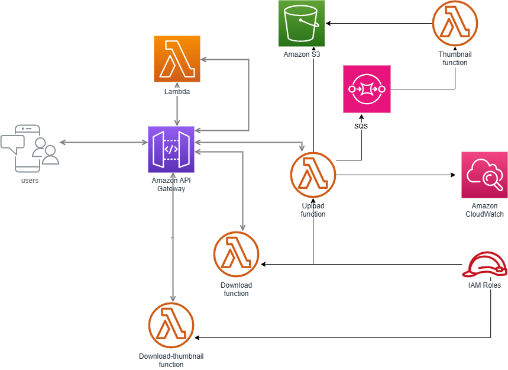

## Overview:
The architecture is designed to handle multiple concurrent requests, ensuring scalability, asynchronous processing, and high availability.

## Components:
- **API Gateway + Lambda:** Handles multiple concurrent requests by scaling horizontally.
- **S3:** Provides high availability and durability for storing images and thumbnails.
- **SQS:** Decouples the image upload and thumbnail processing. Ensures no data loss during high traffic.

## Architecture

## Functional Block Diagram

#### **/upload API**

                            +------------------------+
                            |    API Gateway         |
                            |------------------------|
                            |  /upload (POST)        |
                            +------------------------+
                                      |
                                      v
                         +--------------------------+
                         |     Lambda Function 1    |
                         |--------------------------|
                         | - Handles image uploads  |
                         | - Stores images in S3    |
                         | - Sends message to SQS   |
                         +--------------------------+
                                      |
                                      v
                          +-----------------------+
                          |    Amazon S3 Bucket   |
                          |-----------------------|
                          | - Stores original     |
                          |   images              |
                          | - Stores thumbnails   |
                          +-----------------------+
                                      ^
                                      |
                         +-------------------------+
                         |     Amazon SQS Queue    |
                         |-------------------------|
                         | - Receives image upload |
                         |   messages              |
                         +-------------------------+
                                      |
                                      v
                         +--------------------------+
                         |    Lambda Function 2     |
                         |--------------------------|
                         | - Listens to SQS Queue   |
                         | - Generates thumbnail    |
                         | - Stores thumbnail in S3 |
                         +--------------------------+

	
	
#### **/download image API**

                            +-------------------------------+
                            |    API Gateway                |
                            |-------------------------------|
                            |  /download/{image-name}(GET)  |
                            +-------------------------------+
                                      |
                                      v
                         +----------------------------------+
                         |     Lambda Function 3            |
                         |----------------------------------|
                         | - Gets the image object from s3  |
                         +----------------------------------+
                                     
                        

#### **/download-thumbnail API**

		 	        +-----------------------------------+
                            |    API Gateway                    |
                            |-----------------------------------|
                            |  /download-thumbnail/{image-name} |
			        | 		(GET)               |
                            +-----------------------------------+
                                      |
                                      v
                         +----------------------------------+
                         |     Lambda Function 4            |
                         |----------------------------------|
                         | - Gets the thumbnail object of   |
			     |      image stored in s3          |
                         +----------------------------------+
                                     
